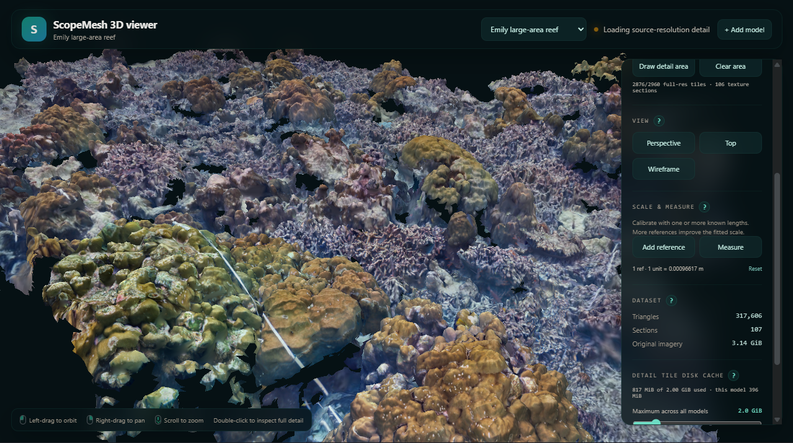
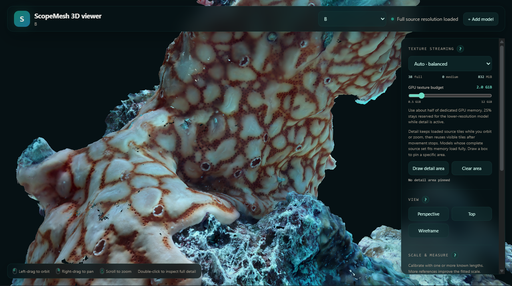

# ScopeMesh 3D viewer

ScopeMesh is a local viewer for large, textured photogrammetry meshes in Wavefront OBJ format, with MTL materials and referenced texture images. It is built for 3D practitioners who need to inspect high-resolution models on modest laptops and low-spec GPUs.

It adaptively loads low-, medium-, or source-resolution textures for the current view, and can pin a user-selected area at source resolution for controlled, localized inspection.



## Why ScopeMesh

Large photogrammetry models can be difficult to explore when their full texture set exceeds GPU memory. Loading everything at once makes navigation slow or can prevent the model from opening at all.

ScopeMesh keeps a lightweight overview available, streams better textures where they matter, and loads original pixels only for the area being inspected. GPU use stays within a budget you control, while source files remain untouched.

Everything runs locally. Models, generated assets, measurements, and cached detail stay on the machine.

## Features

- **Large textured OBJ support** — add a model from the app; conversion happens in the background.
- **Responsive navigation** — a compact overview stays available while texture detail streams in.
- **Adaptive texture quality** — Auto, Overview, and Detail modes balance clarity and GPU use.
- **Source-resolution inspection** — double-click a surface or draw an area to load its original texture pixels.
- **Predictable memory use** — set a GPU texture budget from 0.5 to 12 GiB without restarting.
- **Configurable detail cache** — set a 0.5 to 10 GiB disk limit; generated detail tiles load faster next time and are removed oldest-first when the limit is reached.
- **Scale calibration** — add one or more known-length references; ScopeMesh fits a shared scale for the model.
- **3D measurements** — measure straight-line distances between surface points in model units or calibrated real-world units.
- **Non-destructive workflow** — original geometry and textures are read-only.

## Requirements

### To run ScopeMesh

- **Windows 10 or 11** for the included launcher and model file picker.
- **Node.js 20.19+ or 22.12+**, with npm. Node.js is not included.
- **A modern WebGL 2 browser**, such as Chrome, Edge, or Firefox.
- 

### Model input

- A Wavefront **OBJ** containing mesh geometry and texture coordinates.
- An **MTL** file referenced by the OBJ with `mtllib`.
- A diffuse texture assigned to every used material with `map_Kd`.
- All referenced texture images available beside the OBJ or in relative subfolders.

ScopeMesh triangulates polygon faces during import. It does not require you to modify, resize, or move the source files.

## Use the app

1. Double-click **`Launch ScopeMesh 3D viewer.cmd`**.
2. Click **+ Add model**.
3. Choose a textured `.obj` file and optionally give it a display name.
4. Keep the app open while it creates lightweight viewing assets.

Generated assets are stored under `datasets/`; the original model is not modified.

## Included example

The repository includes the complete **Sponge** source model under `app/examples/Sponge/` and its lightweight prepared viewing assets under `app/datasets/sponge/`. Sponge opens automatically on a fresh clone, so the viewer is ready to explore immediately after launch. This example is intentionally small: it demonstrates the complete workflow while keeping the repository within practical GitHub limits and avoiding a large download every time someone clones it.



## Quality and detail

- **Auto** balances navigation speed and texture clarity.
- **Overview** favors fast movement and low memory use.
- **Detail · aggressive** upgrades the visible view after the camera settles, when it fits the GPU budget.
- **Draw detail area** pins source-resolution texture tiles for a selected part of the model.

If the model's complete source-resolution texture set fits the GPU texture budget, both **Auto · balanced** and **Detail · aggressive** load the entire model at full source resolution. The top status bar shows **Full source resolution loaded** once every source texture has finished loading. Otherwise, ScopeMesh streams the best available texture detail within the budget. After a drawn area or the automatic visible-detail view finishes loading all requested source tiles, the status bar confirms that area or visible detail is fully loaded at source resolution.

ScopeMesh only loads a selected area when it can cover the complete selection safely. If it cannot fit, the app asks for a smaller area instead of showing incomplete patches.

Detail tiles are created from the original textures on first use, then cached on disk. You can set the cache limit from 0.5 to 10 GiB in 0.5 GiB steps and clear tiles for one model or all models. Clearing the cache never removes source files or prepared models.

The default GPU texture budget is 2 GiB, a practical starting point for a 4 GB GPU. As a rule of thumb, start near half of the GPU's dedicated memory. This setting is the total budget for the whole model, not the amount available only to a source-resolution detail area. While detail tiles are active, ScopeMesh reserves 25% of the budget for a lower-resolution view of the rest of the model and makes the remaining 75% available to detail. For example, a 2.0 GiB total budget allows up to 1.5 GiB of source-resolution detail, so a box estimated at 1.7 GiB will be rejected even though its estimate is below the total budget shown by the slider.

## Controls

- **Left drag:** orbit
- **Right drag:** pan
- **Mouse wheel:** zoom toward the cursor
- **Double-click:** focus a surface and prioritize its detail
- **Top / Perspective:** reset the camera orientation
- **Draw detail area:** select and pin an area at source resolution
- **Add reference:** click both ends of a known length, then enter its real length
- **Measure:** click two surface points to measure the straight-line 3D distance

## Calibration

Calibration is saved separately for each model in the browser. Multiple reference lengths improve the fitted scale. **Reset** removes all references and returns measurements to model units.

Measurements are direct 3D distances between two selected points; they do not follow the surface contour.

## Development

```powershell
cd app
npm install
npm run dev
```

Open <http://127.0.0.1:4173>. Useful checks:

```powershell
npm test
npm run build
```
